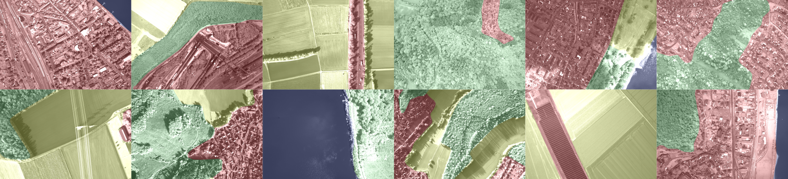

# Semantic Segmentation

Scripts for training semantic segmentation CNNs, based on [pytorch-segmentation](https://github.com/yassouali/pytorch-segmentation), and used within experiments of the IROS 2024 submission *Semantic Clustering of Image Retrieval Databases used for Visual Localization*.

    

Structure and usage are close/similar to the [original repository](https://github.com/yassouali/pytorch-segmentation?tab=readme-ov-file#training), yet changes have been made regarding the *4Seasons dataset* and the limitation to grayscale images. Semantic annotation masks for geo-referenced aerial image captures have been generated using [a wms service for the CORINE Land Cover (CLC)](https://gdz.bkg.bund.de/index.php/default/wms-corine-land-cover-5-ha-stand-2018-wms-clc5-2018.html).

